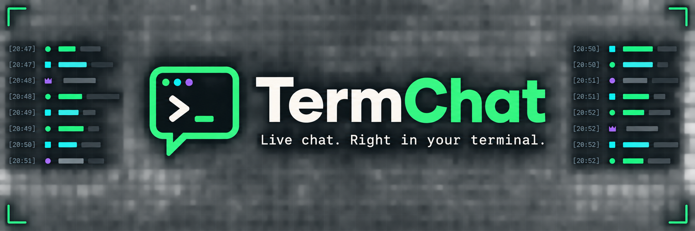
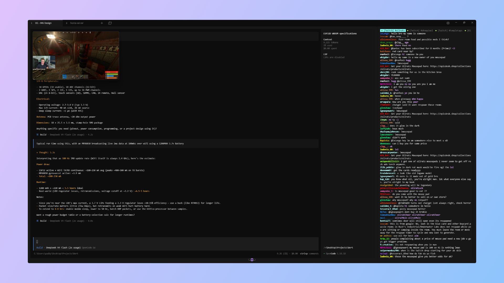

[](https://github.com/paddybuilds/TermChat/actions/workflows/ci.yml)

# TermChat

TermChat is a lightweight, read-only terminal UI for following Twitch and Kick chat. Watch several channels side by side without signing in, while keeping native emotes, 7TV emotes, badges, and moderation events visible in a fast keyboard-driven interface.

## Highlights

- Twitch and Kick channels in independent, platform-labelled tabs
- Anonymous, read-only connections with no account credentials to store
- Native platform emotes plus global and channel-specific 7TV emotes
- Live 7TV emote-set updates without restarting the application
- Kitty, iTerm2, and Sixel image support with a Unicode fallback
- Visible moderation history for deletions, timeouts, bans, unbans, and chat clears
- Persistent channels, image preferences, and badge preferences
- Automatic reconnects with per-channel connection status

## Preview



## Coming soon

- YouTube Live Chat support alongside Twitch and Kick
- OAuth account connections for authenticated chat, including sending messages directly from TermChat

Until these features arrive, TermChat remains anonymous and read-only.

## Install

### Cargo

Rust 1.88 or newer is required when installing from source:

```console
cargo install termchat-live
```

This installs the `termchat` command.

### Release archive

Prebuilt archives, when available, can be downloaded from [GitHub Releases](https://github.com/paddybuilds/TermChat/releases).

## Quick start

Open TermChat with your saved channels:

```console
termchat
```

Add channels at startup by name or URL:

```console
termchat twitch twitchdev
termchat twitch twitchdev moonmoon
termchat twitch https://www.twitch.tv/twitchdev

termchat kick xqc
termchat kick xqc trainwreckstv
termchat kick https://kick.com/xqc
```

Control emote images and identity badges from the command line:

```console
termchat twitch twitchdev --images off
termchat kick xqc --badges off
```

`--images` accepts `auto` or `off`; `--badges` accepts `on` or `off`. Explicit flags override saved preferences for that launch and are then persisted. Omitting a flag preserves the saved preference.

Channels supplied on the command line are added to the saved channel list. You can also add, remove, switch, and manage channels from the in-app command palette.

## Controls

| Key | Action |
| --- | --- |
| `Super-K` / `Ctrl-K` | Open or close the command palette |
| `Left` / `Right` | Switch to the previous or next channel |
| `Up` / `Down` | Scroll one row |
| `Page Up` / `Page Down` | Scroll one page |
| `Home` | Jump to the oldest retained message |
| `End` | Jump to the latest message and resume following |
| `q` / `Ctrl-C` | Quit |

Type in the command palette to filter its actions. Use `Up` and `Down` to select an action, `Enter` to run it, and `Esc` to close the palette. Available actions include adding, removing, and switching channels; toggling emote images and identity badges; and quitting TermChat.

## Chat experience

### Channels and state

Every channel has its own connection, message history, scroll position, 7TV emote set, and connection indicator. Twitch and Kick channels with the same name can be open simultaneously. Indicators use green for connected, yellow for connecting or reconnecting, and red for disconnected.

Saved channels and preferences are stored in the operating system's standard configuration directory.

### Emotes and terminal graphics

TermChat displays Twitch, Kick, and 7TV emotes. Recognized emote messages are staged briefly while images load so they enter the feed in their final layout and remain in order. Failed image requests fall back to the emote name.

Kitty, iTerm2, and Sixel graphics are detected automatically. Other terminals use a Unicode half-block renderer. Windows Terminal 1.22 and newer receives an explicit Sixel hint when its capability response omits font-cell dimensions. Animated Kick and 7TV emotes currently render their first frame, and zero-width overlays use their text names.

Downloaded emotes are stored in the operating system's standard cache directory and pruned to a 64 MiB limit.

### Moderation and badges

Deleted messages remain in the feed, dimmed and labelled. Timeouts, bans, unbans, and full-chat clears appear as moderation notices, and matching messages already in local history are dimmed when applicable. Moderator names are shown when the platform includes them.

Identity badges appear as compact chips before usernames. TermChat recognizes common broadcaster, moderator, VIP, subscriber, founder, staff, administrator, verified, bot, artist, OG, and Kick level badges. Unknown badges receive an abbreviated fallback chip. Badges are enabled by default.

## Platform notes

### Twitch

TermChat uses Twitch's legacy anonymous IRC compatibility mode (`justinfan`, without a password). Twitch still accepts this for read-only chat, but it is not part of Twitch's current documented authentication contract. If Twitch removes it, TermChat reports the rejection instead of requesting or storing credentials.

### Kick

Kick's official receive-chat API delivers events to a publicly accessible webhook, which is not a natural fit for a standalone terminal application. TermChat therefore resolves channels through Kick's internal website API and reads its public Pusher WebSocket without authentication. These interfaces are undocumented and may change without notice; failures are reported in the affected tab and retried automatically.

Kick channel resolution requires `curl` on `PATH`. It is included with Windows 10 and newer and is commonly preinstalled on macOS and Linux. See [Kick's official Events API documentation](https://github.com/KickEngineering/KickDevDocs/blob/main/events/introduction.md) for the supported webhook alternative.

### 7TV

7TV integration is optional and non-blocking. Twitch and Kick chat continue when the 7TV API, EventAPI, CDN, or an individual image is unavailable.

## Development

TermChat uses Rust 2024 and requires Rust 1.88 or newer.

```console
cargo fmt --all -- --check
cargo clippy --all-targets --all-features -- -D warnings
cargo test --all-features
cargo build --release
```

The public chat model, target model, and `PlatformAdapter` trait are platform-neutral, allowing additional chat transports to be added without changing the feed renderer.

## Acknowledgements

TermChat was inspired by [dmmulroy/cf-twitch](https://github.com/dmmulroy/cf-twitch) after seeing its similar terminal-based setup for a Twitch client.

## License

TermChat is available under the [MIT License](LICENSE).
